<div align="center">
  <br>
  
  <br><br>
  
  <br><br>
  
  [](https://tourandtraveltouch.great-site.net)
  [](https://github.com/mahfujul-01726/TourAndTravelTouch)
  []()
  
  <br>

  <table align="center">
    <tr>
      <td align="center"></td>
      <td align="center"></td>
      <td align="center"></td>
      <td align="center"></td>
      <td align="center"></td>
    </tr>
  </table>
</div>

<br>

```ascii
╔══════════════════════════════════════════════════════════════════════╗
║                                                                      ║
║   ████████╗ ██████╗ ██╗   ██╗██████╗     █████╗ ███╗   ██╗██████╗   ║
║   ╚══██╔══╝██╔═══██╗██║   ██║██╔══██╗   ██╔══██╗████╗  ██║██╔══██╗  ║
║      ██║   ██║   ██║██║   ██║██████╔╝   ███████║██╔██╗ ██║██║  ██║  ║
║      ██║   ██║   ██║██║   ██║██╔══██╗   ██╔══██║██║╚██╗██║██║  ██║  ║
║      ██║   ╚██████╔╝╚██████╔╝██║  ██║   ██║  ██║██║ ╚████║██████╔╝  ║
║      ╚═╝    ╚═════╝  ╚═════╝ ╚═╝  ╚═╝   ╚═╝  ╚═╝╚═╝  ╚═══╝╚═════╝   ║
║                                                                      ║
║              ████████╗██████╗  █████╗ ██╗   ██╗███████╗██╗          ║
║              ╚══██╔══╝██╔══██╗██╔══██╗██║   ██║██╔════╝██║          ║
║                 ██║   ██████╔╝███████║██║   ██║█████╗  ██║          ║
║                 ██║   ██╔══██╗██╔══██║╚██╗ ██╔╝██╔══╝  ██║          ║
║                 ██║   ██║  ██║██║  ██║ ╚████╔╝ ███████╗███████╗     ║
║                 ╚═╝   ╚═╝  ╚═╝╚═╝  ╚═╝  ╚═══╝  ╚══════╝╚══════╝     ║
║                                                                      ║
║                     ✦ Full-Stack Travel Booking ✦                    ║
║                   ───────────────────────────────                     ║
║            PHP 8+ · MySQL · Vanilla JavaScript · Bootstrap 5          ║
║                                                                      ║
╚══════════════════════════════════════════════════════════════════════╝
```

<br>

<div align="center">
  <table>
    <tr>
      <td width="25%" align="center">
        <br>
        
        <br><br>
        <strong>6 Destinations</strong>
        <br>
        <sub>Across Bangladesh</sub>
        <br><br>
      </td>
      <td width="25%" align="center">
        <br>
        
        <br><br>
        <strong>Full Booking Flow</strong>
        <br>
        <sub>Register → Browse → Book</sub>
        <br><br>
      </td>
      <td width="25%" align="center">
        <br>
        
        <br><br>
        <strong>Live Demo</strong>
        <br>
        <sub>Hosted & Deployed</sub>
        <br><br>
      </td>
      <td width="25%" align="center">
        <br>
        
        <br><br>
        <strong>Security First</strong>
        <br>
        <sub>CSRF · bcrypt · XSS Safe</sub>
        <br><br>
      </td>
    </tr>
  </table>
</div>

---

## 🌟 Why This Project Stands Out

> *"No frameworks. No magic. Just clean, intentional engineering."*

This isn't another Laravel clone or a WordPress travel theme. **Tour And Travel Touch** is built hands-on from the ground up — every SQL query hand-crafted with prepared statements, every animation frame-tuned, every form submission guarded by CSRF tokens. It proves that vanilla PHP paired with modern frontend engineering can deliver a production-ready experience that competes with stack-heavy alternatives.

**What this demonstrates:**
- 🛡️ **Security-first mindset** — bcrypt (cost 12), CSRF on every POST, XSS-sanctioned output
- 🎨 **Frontend craftsmanship** — 3D tilt cards, particle systems, parallax depth, glassmorphism UI
- 🏗️ **Clean architecture** — separation of concerns without framework overhead
- 🚀 **CI/CD automation** — GitHub Actions pushing to production on every commit

<details>
<summary>📸 <strong>Click to see project previews</strong></summary>
<br>

<div align="center">
  <table>
    <tr>
      <td width="50%" align="center">
        <strong>🏠 Landing Page</strong><br>
        
        <br><sub>Parallax hero with glassmorphism nav and 3D destination cards</sub>
      </td>
      <td width="50%" align="center">
        <strong>📖 About Section</strong><br>
        
        <br><sub>Responsive about layout with scroll-reveal animations</sub>
      </td>
    </tr>
    <tr>
      <td width="50%" align="center">
        <strong>📝 Booking Form</strong><br>
        
        <br><sub>CSRF-protected booking form with date validation</sub>
      </td>
      <td width="50%" align="center">
        <strong>🖼️ Gallery Grid</strong><br>
        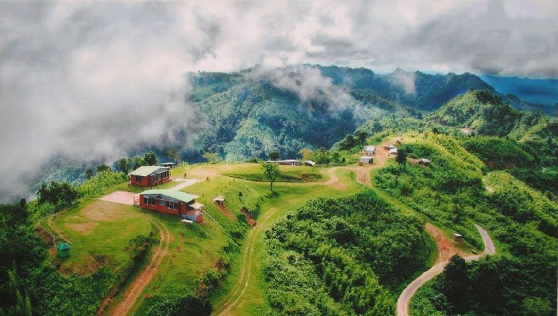
        <br><sub>Hover-zoom gallery with particle network overlay</sub>
      </td>
    </tr>
    <tr>
      <td width="50%" align="center">
        <strong>🌐 Live Interactive Homepage</strong><br>
        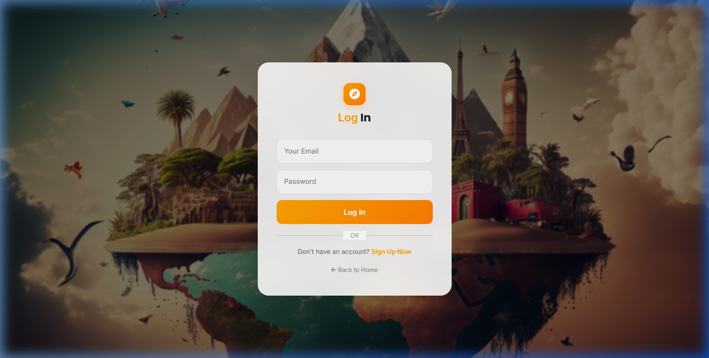
        <br><sub>Stunning live homepage with requestAnimationFrame parallax and active particle network</sub>
      </td>
      <td width="50%" align="center">
        <strong>🔑 Live User Login Portal</strong><br>
        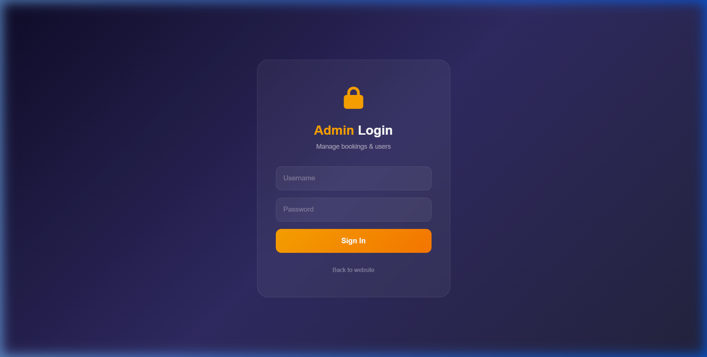
        <br><sub>Secure login flow with session regeneration and interactive styling</sub>
      </td>
    </tr>
    <tr>
      <td colspan="2" align="center">
        <strong>👑 Live Admin Authentication Portal</strong><br>
        
        <br><sub>Secure standalone admin gatekeeper console with server-side validations</sub>
      </td>
    </tr>
  </table>
</div>

</details>

<br>

---

## 🗺️ Destinations

<div align="center">

| 🏕️ Destination | 📍 Region | 🏷️ Type | 💰 Starting From |
|---|---|---|---|
| **Sundarbans** 🌿 | Khulna | Mangrove Forest · UNESCO World Heritage | **5,000 ৳** |
| **Srimangal** 🍵 | Sylhet | Tea Garden · Rainforest | **5,500 ৳** |
| **Rangamati** 🏞️ | Chittagong Hill Tracts | Lake District · Hill Station | **7,700 ৳** |
| **Bandarbans** ⛰️ | Chittagong Hill Tracts | Hill Tracks · Trekking | **6,000 ৳** |
| **Saint Martin** 🏖️ | Bay of Bengal | Coral Island · Beach | **8,000 ৳** |
| **Shait-Gumbad Mosque** 🕌 | Bagerhat | Historic Mosque · UNESCO Tentative | **1,500 ৳** |

</div>

<br>

<div align="center">
  <table>
    <tr>
      <td align="center"><strong>Sundarbans 🌿</strong><br></td>
      <td align="center"><strong>Srimangal 🍵</strong><br></td>
      <td align="center"><strong>Rangamati 🏞️</strong><br>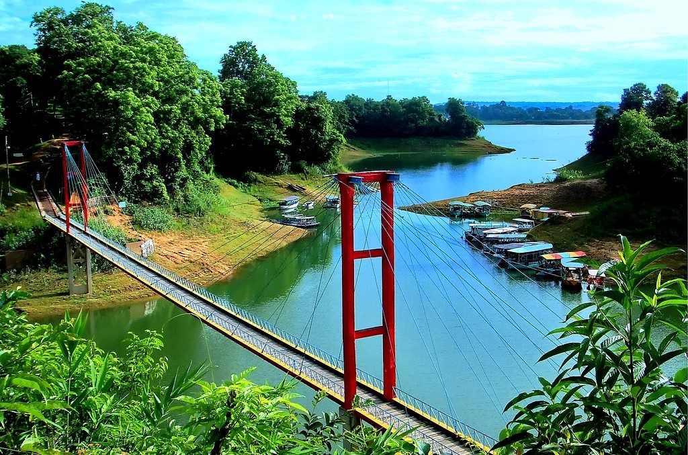</td>
    </tr>
    <tr>
      <td align="center"><strong>Bandarbans ⛰️</strong><br>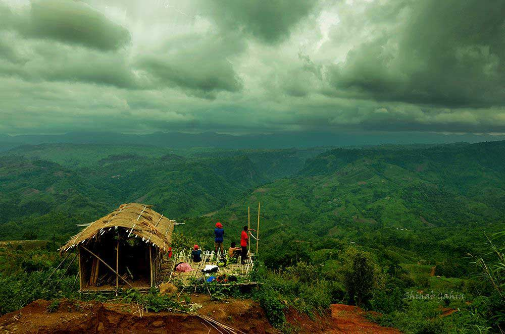</td>
      <td align="center"><strong>Saint Martin 🏖️</strong><br></td>
      <td align="center"><strong>Shait-Gumbad 🕌</strong><br></td>
    </tr>
  </table>
</div>

<p align="center"><em>🌸 Prices in Bangladeshi Taka (BDT). Packages include guided tours & standard accommodations.</em></p>

---

## 🎯 User Journey — How a Booking Happens

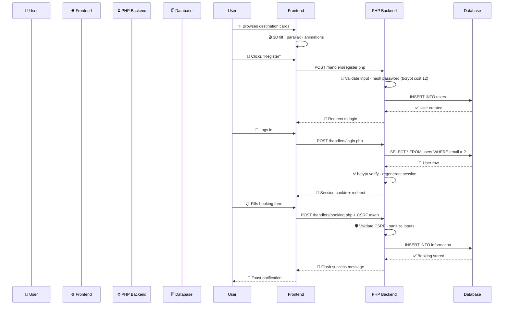

---

## ✨ Features

<div align="center">
  <br>
  
  ### 🎨 Frontend Magic
  
  <br>
  
  <table>
    <tr>
      <td width="50%">
        <h4>🎯 3D Tilt Cards</h4>
        <sub>Interactive CSS 3D transforms — cards rotate on mouse hover with smooth easing</sub>
      </td>
      <td width="50%">
        <h4>🌊 Particle Network</h4>
        <sub>Canvas API nodes connected by spring-force edges, reacting to mouse movement</sub>
      </td>
    </tr>
    <tr>
      <td width="50%">
        <h4>🖼️ Background Slideshow</h4>
        <sub>Cross-fade opacity transitions with preloaded images — zero flicker</sub>
      </td>
      <td width="50%">
        <h4>🌀 Parallax Hero</h4>
        <sub>3-layer depth offsets driven by requestAnimationFrame for silky motion</sub>
      </td>
    </tr>
    <tr>
      <td width="50%">
        <h4>🎬 Scroll Reveal</h4>
        <sub>IntersectionObserver triggers fade/slide animations at configurable thresholds</sub>
      </td>
      <td width="50%">
        <h4>🎨 Theme Switching</h4>
        <sub>Two complete color palettes (Orange/Black & Red/Green) via CSS custom properties</sub>
      </td>
    </tr>
    <tr>
      <td width="50%">
        <h4>🔮 Glassmorphism UI</h4>
        <sub>Backdrop-filter blur on nav, modals, cards — modern and sleek</sub>
      </td>
      <td width="50%">
        <h4>🔔 Toast Notifications</h4>
        <sub>JSON-consumed flash messages with auto-dismiss timers</sub>
      </td>
    </tr>
  </table>

  <br>
  
  ### ⚙️ Backend Power
  
  <br>
  
  <table>
    <tr>
      <td width="50%">
        <h4>🔐 Auth System</h4>
        <sub>Email/password registration · bcrypt (cost 12) · Session-based login/logout</sub>
      </td>
      <td width="50%">
        <h4>📋 Booking Engine</h4>
        <sub>Create, view, search bookings with server-side date validation</sub>
      </td>
    </tr>
    <tr>
      <td width="50%">
        <h4>🛡️ CSRF Protection</h4>
        <sub>32-byte random tokens · Validated on every state-mutating POST</sub>
      </td>
      <td width="50%">
        <h4>🔍 Search</h4>
        <sub>Prepared-statement LIKE queries across destinations & customer data</sub>
      </td>
    </tr>
    <tr>
      <td width="50%">
        <h4>📊 Admin Dashboard</h4>
        <sub>Separate auth realm · Booking & user management tables with stats</sub>
      </td>
      <td width="50%">
        <h4>📨 Flash Messaging</h4>
        <sub>Session-backed success/error system · Consumed via JSON endpoint</sub>
      </td>
    </tr>
  </table>
</div>

<br>

---

## 📖 About & Booking

<div align="center">
  <table>
    <tr>
      <td width="50%" align="center">
        <strong>🏕️ About Tour And Travel Touch</strong><br><br>
        
        <br><br>
        <sub>Discover hand-picked destinations across Bangladesh with immersive visuals and seamless booking.</sub>
      </td>
      <td width="50%" align="center">
        <strong>📝 Book Your Journey</strong><br><br>
        
        <br><br>
        <sub>Secure CSRF-protected booking with date validation and instant confirmation.</sub>
      </td>
    </tr>
  </table>
</div>

<br>

---

## 🖼️ Gallery Preview

<div align="center">
  <table>
    <tr>
      <td></td>
      <td></td>
      <td></td>
      <td></td>
      <td></td>
      <td>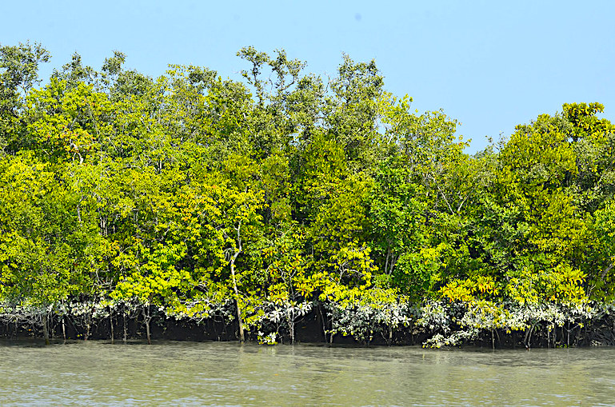</td>
    </tr>
  </table>
  <sub>🌄 Scenic gallery showcasing Bangladesh's natural beauty</sub>
</div>

<br>

---

## 🛠️ Tech Stack

<div align="center">

| 🎨 **Frontend** | ⚡ **Backend** | 🗄️ **Database** | 🚀 **DevOps** |
|---|---|---|---|
| HTML5 · CSS3 · JS (ES6+) | PHP 8+ (vanilla) | MySQL / MariaDB | GitHub Actions |
| Bootstrap 5.0.2 | `mysqli` prepared stmts | Relational schema | FTP deployment |
| Font Awesome 6.2.1 | Session auth · CSRF | 3 tables | InfinityFree |
| Google Fonts (Poppins, Inter) | bcrypt (cost 12) | Indexed queries | Zero-downtime |

</div>

---

## 🗄️ Database Schema

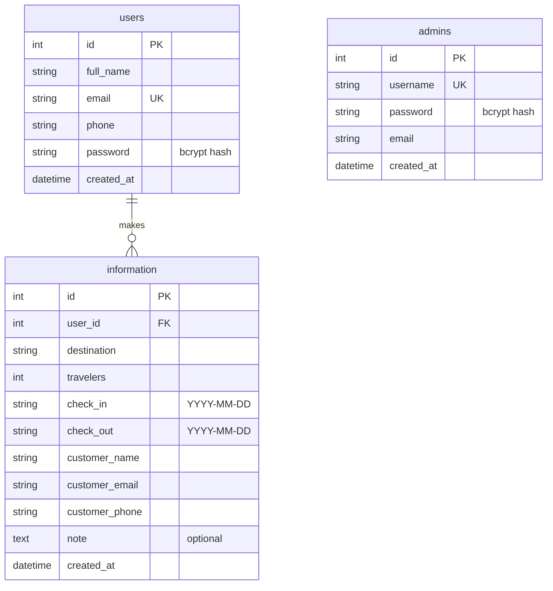

---

## 🏗️ System Architecture

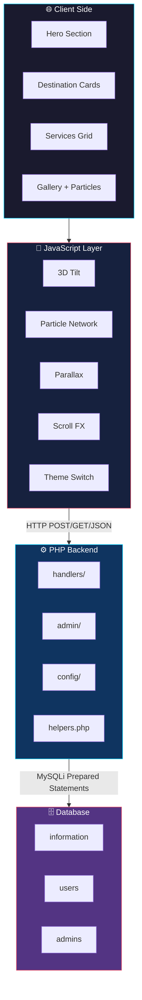

---

## 🔐 Authentication Flow

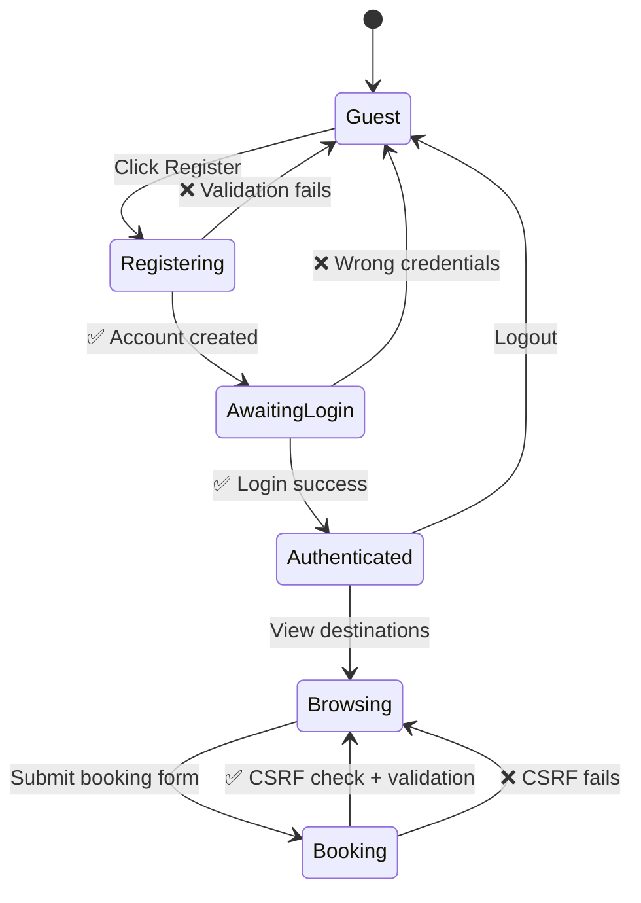

---

## 📂 Project Map

```ascii
📦 TourAndTravelTouch
├── 📄 index.html                          # Single-page frontend
├── 📁 pages/                              # Auth pages
│   ├── 📄 login.html
│   └── 📄 signup.html
├── 📁 backend/
│   ├── 📁 config/
│   │   ├── 📄 app.php                     # CORS, session, URL config
│   │   └── 📄 database.php                # mysqli connection
│   ├── 📄 helpers.php                     # Shared utilities
│   ├── 📁 handlers/                       # 7 request processors
│   └── 📁 admin/                          # Admin panel
├── 📁 assets/
│   ├── 📁 css/
│   │   ├── 🎨 theme-orange.css
│   │   └── 🎨 theme-red.css
│   ├── 📁 js/
│   │   └── 📄 config.js                   # Backend URL config
│   └── 📁 images/                         # Destination photos
├── 📁 database/
│   └── 📄 schema.sql                      # Full schema + seeds
└── 📁 .github/workflows/
    └── ⚡ deploy.yml                       # CI/CD pipeline
```

---

## 🚀 Getting Started

### 📋 Prerequisites

| Tool | Version |
|------|---------|
| PHP | 8.0+ |
| MySQL / MariaDB | 5.7+ / 10.3+ |
| Web Server | Apache, Nginx, or local (XAMPP/WAMP/Laragon) |

### 🪜 Step-by-Step Setup

```bash
# 📥 1. Clone the repository
git clone https://github.com/mahfujul-01726/TourAndTravelTouch.git
cd TourAndTravelTouch

# 🗄️ 2. Import the database
mysql -u root -p your_database_name < database/schema.sql

# ⚙️ 3. Configure backend
#    → backend/config/database.php — set your DB credentials
#    → backend/config/app.php — set FRONTEND_URL

# 🎨 4. Configure frontend
#    → assets/js/config.js — set BACKEND_URL

# 🌐 5. Serve
#    Point your web server to the project directory and open index.html
```

### ☁️ Production Deployment (InfinityFree)

| Step | Action |
|------|--------|
| 1 | Create account at [infinityfree.com](https://infinityfree.com) |
| 2 | Create MySQL DB via control panel |
| 3 | Import `database/schema.sql` via phpMyAdmin |
| 4 | Update `backend/config/database.php` with live credentials |
| 5 | Upload all files to `htdocs/` via FTP |
| 6 | Verify live URL |

> **💡 Pro tip:** The CI/CD pipeline automates step 5 on every push to `main` — see the [CI/CD](#cicd-pipeline) section.

---

## ⚙️ Configuration Reference

| File | Variable(s) | Purpose |
|---|---|---|
| `backend/config/database.php` | `DB_HOST`, `DB_USER`, `DB_PASS`, `DB_NAME` | Database connection |
| `backend/config/app.php` | `FRONTEND_URL`, `SESSION_NAME` | CORS origin, session cookie name |
| `assets/js/config.js` | `BACKEND_URL` | Base URL for all AJAX calls |

> ✅ All URLs and credentials are centralized — zero hardcoded values in handler or view code.

---

## 🔐 Admin Panel

<div align="center">

| 🔑 Detail | 📋 Value |
|---|---|
| **🌐 Live URL** | [tourandtraveltouch.great-site.net/backend/admin/login.php](https://tourandtraveltouch.great-site.net/backend/admin/login.php) |
| **📁 Local URL** | `/backend/admin/login.php` |
| **👤 Default Username** | `admin` |
| **🔑 Default Password** | `admin123` |
| **✅ Auto-provisioned** | On first login |

<br>

<br>

</div>

> **⚠️ Security notice:** Change the default password immediately after first login. The admin panel inherits the same CSRF + prepared-statement protections as public handlers.

---

## 🛡️ Security Model

<div align="center">

| 🚨 Threat | 🛡️ Mitigation |
|---|---|
| **SQL Injection** | 100% `mysqli` prepared statements — no raw SQL concatenation |
| **XSS** | `htmlspecialchars()` with `ENT_QUOTES \| ENT_HTML5` on every output |
| **Password Leak** | bcrypt hashing, cost factor 12 (~250ms/hash on modern hardware) |
| **CSRF** | 32-byte session tokens validated on all POST handlers |
| **Session Hijacking** | HTTP-only · Secure · SameSite=Lax · Regeneration on privilege elevation |
| **Info Leakage** | Generic user-facing errors · Detailed logs server-side only |

</div>

---

## ⚡ Performance

| Optimization | Detail |
|---|---|
| **GPU-accelerated animations** | `transform` / `opacity` only — no layout thrashing |
| **Frame-rate stability** | `requestAnimationFrame` with delta-time normalization |
| **Zero flicker slideshow** | Images preloaded in JS before display |
| **Efficient queries** | Scoped, indexed — no `SELECT *` in production |
| **No ORM tax** | Every query hand-tuned for the exact access pattern |

---

## 🚀 CI/CD Pipeline

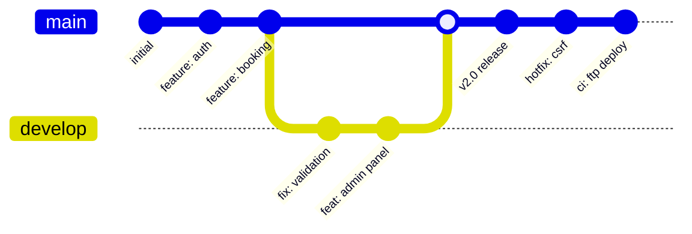

Every push to `main` triggers an automated deployment:

```yaml
# .github/workflows/deploy.yml
name: Deploy to InfinityFree
on:
  push:
    branches: [main]
jobs:
  deploy:
    runs-on: ubuntu-latest
    steps:
      - uses: actions/checkout@v3
      - name: FTP Deploy
        uses: SamKirkland/FTP-Deploy-Action@v4.3.4
        with:
          server: ${{ secrets.FTP_SERVER }}
          username: ${{ secrets.FTP_USERNAME }}
          password: ${{ secrets.FTP_PASSWORD }}
          local-dir: ./
          server-dir: /htdocs/
```

---

## 🤝 Contributing

I believe in **vanilla-first** engineering. This project has zero framework dependencies and that's by design.

<div align="center">

### Contribution Workflow

```ascii
Fork → Feature Branch → Commit → Push → Pull Request
```

</div>

### 📐 Standards

| Rule | Why It Exists |
|---|---|
| ✅ Prepared statements on all SQL | Zero tolerance for injection vectors |
| ✅ CSRF tokens on all POST handlers | Every state change must be authorized |
| ✅ `htmlspecialchars()` on all output | XSS prevention is non-negotiable |
| ✅ PHP 8.0+ & MySQL 5.7+ | Matches production environment |
| ❌ No framework dependencies | Core architectural constraint |

---

## 📄 License

This project is open for educational and portfolio use. See [LICENSE](LICENSE) for details.

---

<br>

<div align="center">
  
  
  <br><br>
  
  <table>
    <tr>
      <td align="center">
        <strong>✍️ Author</strong><br>
        <a href="https://github.com/mahfujul-01726">Mahfujul Karim</a>
      </td>
      <td align="center">
        <strong>🌍 Live Demo</strong><br>
        <a href="https://tourandtraveltouch.great-site.net">tourandtraveltouch.great-site.net</a>
      </td>
      <td align="center">
        <strong>📦 Repository</strong><br>
        <a href="https://github.com/mahfujul-01726/TourAndTravelTouch">GitHub</a>
      </td>
      <td align="center">
        <strong>🔐 Admin Panel</strong><br>
        <a href="https://tourandtraveltouch.great-site.net/backend/admin/login.php">Login</a>
      </td>
    </tr>
  </table>
  
  <br>
  
  <sub>
    <strong>Built with 💙 using PHP, MySQL, and Vanilla JavaScript</strong><br>
    <em>No frameworks. No magic. Just engineering.</em>
  </sub>
  
  <br><br>
  
  <a href="#top">⬆️ Back to top</a>
</div>

<br>
